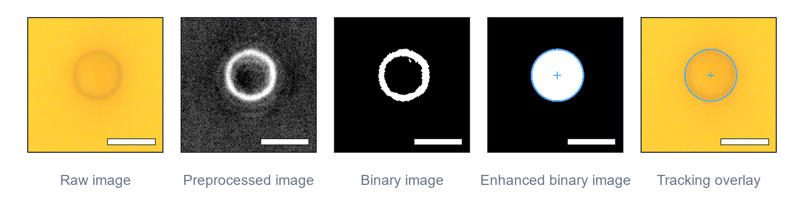

# BF-Particle-Tracker



BF-Particle-Tracker is a DearPyGUI application for brightfield microscopy particle tracking in TIFF and OME-TIFF videos.

The app is designed for an interactive workflow: load a video stack, tune preprocessing, inspect raw/preprocessed/binary/segmented images, validate the initial detection, track the particle trajectory, then export CSV results and JSON metadata.

## Windows Installation

For a new Windows user:

1. Unzip the app folder.
2. Install Python 3.10 or newer from <https://www.python.org/downloads/windows/>.
3. During Python installation, enable **Add python.exe to PATH**.
4. Double-click `installer\install.bat`.
5. Launch `BF-Particle-Tracker` from the Desktop shortcut, or double-click `run_app.bat`.

The installer creates a local `.venv_app` environment inside the app folder. It does not install packages globally on the computer.

## Sharing The App

To create a clean zip package for sharing, run:

```bat
powershell -ExecutionPolicy Bypass -File installer\make_release_zip.ps1
```

The package is created in:

```text
release\BF-Particle-Tracker-windows.zip
```

The person receiving the zip should unzip it, then run:

```text
installer\install.bat
```

## Launch

After installation:

1. Launch `BF-Particle-Tracker` from the Desktop shortcut.
2. Or double-click `run_app.bat`.

Manual launch:

```bat
.venv_app\Scripts\python.exe main.py
```

## Main Workflow

1. Load one or several TIFF/OME-TIFF videos.
2. Adjust preprocessing while comparing raw, preprocessed, binary, and enhanced binary views.
3. Run detection on the current frame.
4. Set the detection as the initial reference.
5. Start tracking.
6. Review trajectory, histograms, and stiffness estimate.
7. Save CSV results and JSON metadata.

## Documentation

Full user documentation is available in:

- `documentation\Particle_Tracking_User_Documentation.html`
- `documentation\Particle_Tracking_User_Documentation.pdf`

## Requirements

Dependencies are listed in `requirements.txt` and are installed into the local `.venv_app` folder.
